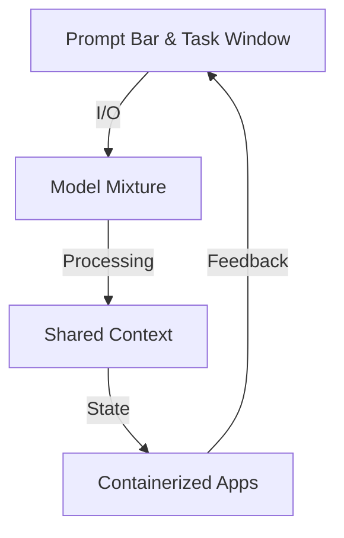

# Introduction to Truffle

Truffle represents a fundamental shift in how we interact with AI - a beautiful computing device that brings local inference and agentic functionality directly to your desktop. Through our MacOS client, you access a sophisticated system that combines powerful local models with a containerized tool ecosystem.

## Core Architecture

At its heart, Truffle operates on four fundamental primitives:



1. **Prompt Bar & Task Window**
   - Natural language interface for user input
   - Real-time task visualization
   - Seamless interaction flow

2. **Model Mixture**
   - Specialized models for different tasks
   - Optimized for edge device performance
   - Efficient resource utilization

3. **Shared Context**
   - Cross-model memory management
   - Persistent state tracking
   - Efficient context sharing

4. **Containerized Applications**
   - Sandboxed execution environments
   - Tool-based interaction model
   - Secure and isolated operations

## The Agent Loop

Unlike traditional language models, Truffle operates on an action-based paradigm:


This creates a continuous loop where:
1. User provides a request
2. Model selects appropriate actions
3. Actions execute in controlled environments
4. System updates based on results
5. Loop continues until task completion

## Model Architecture

Truffle employs a mixture-of-models approach, with each model specialized for specific tasks:

### 1. Action and Reasoning
- Core decision-making engine
- Action selection and planning
- Argument completion and validation
- Specialized sub-behaviors for different tasks

### 2. Vision Processing
- Image interpretation and analysis
- OCR capabilities
- Visual content understanding
- Multi-modal integration

### 3. Generative UI
- Dynamic interface generation
- Task and action titling
- Execution summaries
- Real-time classification

## Technical Innovation

Several key innovations power Truffle's capabilities:

### Action-Based Processing
```python
# Traditional LLM approach
response = model.generate(prompt)

# Truffle's action-based approach
while not task.completed:
    action = model.select_next_action(context)
    result = environment.execute(action)
    context.update(result)
```

### Optimized Token Usage
- Special tokens for high-level actions
- Constrained classification space
- Jump-forward decoding for structured output
- Reduced semantic collisions

### Environmental Feedback
- Real-time execution results
- Grounded decision making
- Reduced accuracy drift
- Continuous context updates

## Security and Isolation

Truffle maintains security through:

1. **Containerization**
   - Ephemeral environments
   - Isolated execution spaces
   - Resource constraints

2. **File Management**
   ```python
   # Files must be explicitly shared
   @truffle.tool(description="Process and share file")
   def process_file(self, data: bytes) -> SharedFile:
       result = self._process(data)
       return self.share_with_user(result)
   ```

3. **State Management**
   - Controlled state persistence
   - Secure context sharing
   - Protected memory spaces

## Performance Optimization

Truffle achieves high performance through:

1. **Model Specialization**
   - Task-specific models
   - Optimized inference paths
   - Efficient resource usage

2. **Memory Management**
   ```python
   class MemoryOptimizedTool:
       def __init__(self):
           self.cache = LRUCache(max_size=DEVICE_MEMORY * 0.85)
   ```

3. **Batched Operations**
   - Smart request batching
   - Efficient GPU utilization
   - Optimized memory patterns
