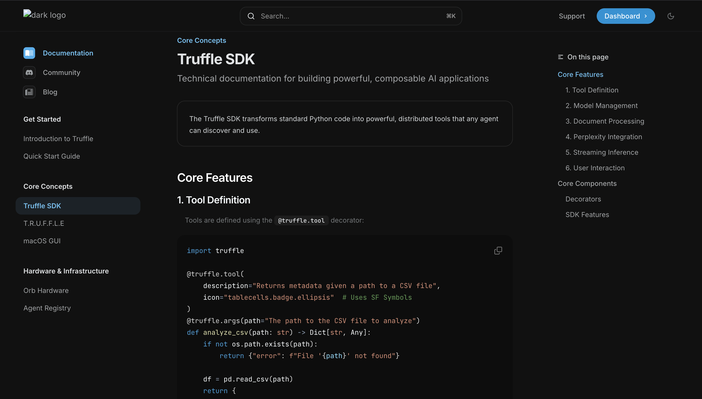

# Truffle Documentation



Truffle's technical documentation is built with [Mintlify](https://mintlify.com)

## Structure

- `introduction.mdx` - Platform overview and core concepts
- `quickstart.mdx` - Getting started guide
- `sdk-public.mdx` - SDK documentation and API reference
- `inference.mdx` - T.R.U.F.F.L.E inference engine
- `macos-gui.mdx` - Native macOS interface
- `orb-hardware.mdx` - Edge hardware specifications
- `agent-registry.mdx` - Decentralized agent marketplace

## Development

Run the documentation locally:

```bash
# Install dependencies
bun install

# Start the development server
bun mintlify dev
```

Visit `http://localhost:3000` to see the documentation.
